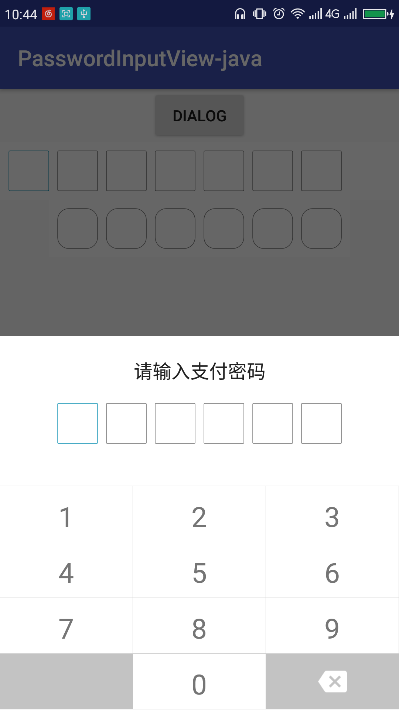
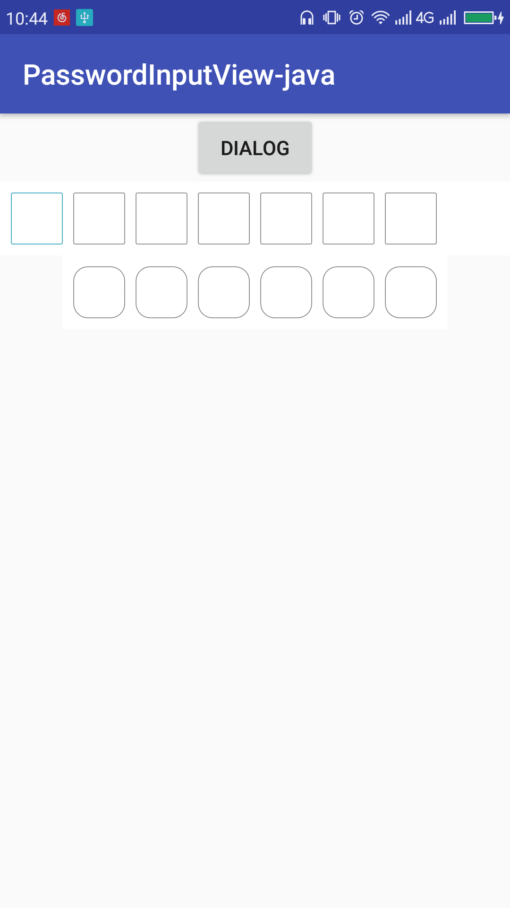

# PasswordinputView
支付密码输入框及支付键盘
## ScreenShot
InputPasswordDialog


PasswordInputView


## Sample Code
```xml
    <cloudist.cc.library.view.PasswordInputView
        android:id="@+id/password_inputview"
        android:layout_width="match_parent"
        android:layout_height="wrap_content"
        android:background="@color/white"
        app:borderWidth="0.5dp"
        app:itemHeight="36dp"
        app:itemPadding="8dp"
        app:passwordLength="7"
        app:borderRadius="1dp"
        app:passwordWidth="6dp" />
```

```Java
  // bind keyBoardDialog to PasswordInputView
  final PasswordInputView passwordInputView = findViewById(R.id.password_inputview);
  passwordInputView.bindKeyBoard(getSupportFragmentManager(), "");
```

```Java
    show InputPasswordDialog

    InputPasswordDialog.newInstance()
            .setTextChangeListener(new TextChangeListener() {
                @Override
                public void textChange(String text) {
                    //TODO
                }
            }).show(getSupportFragmentManager(), "");
```
